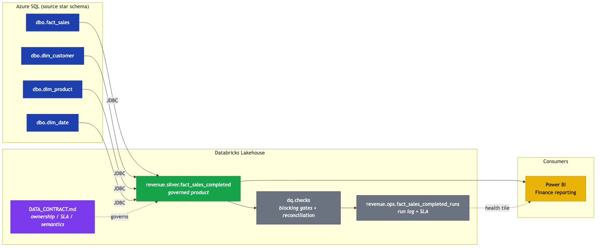
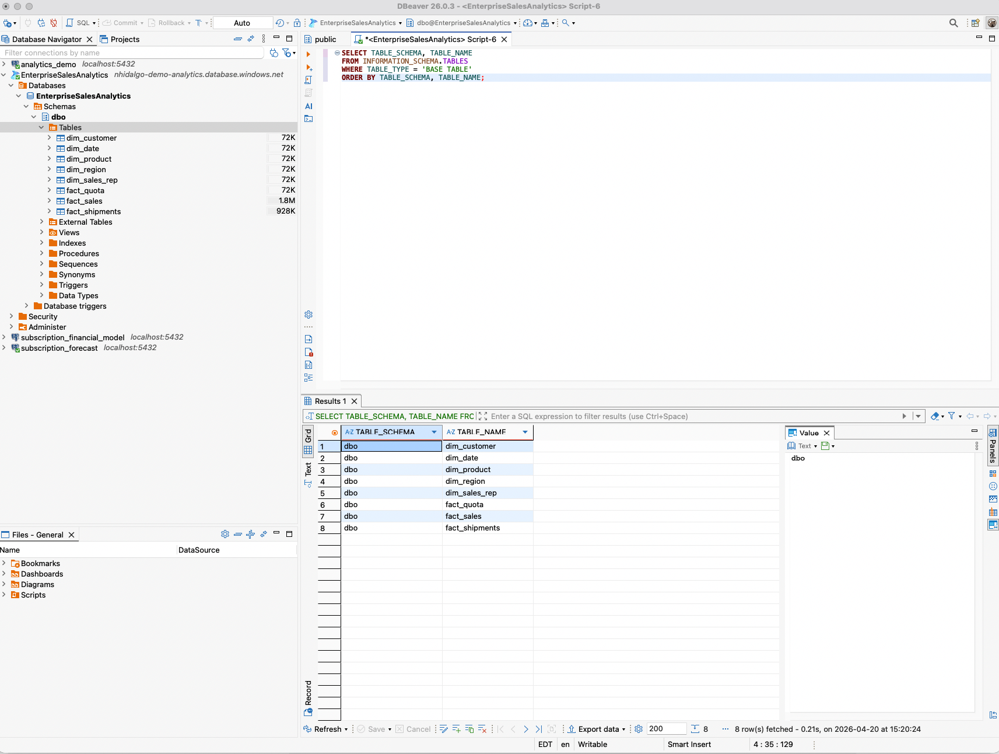
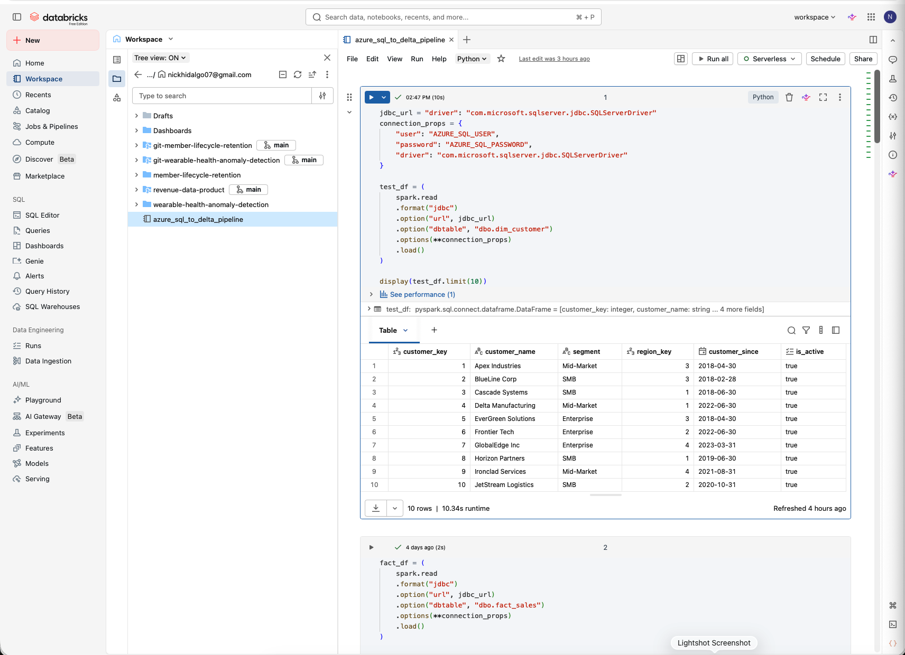
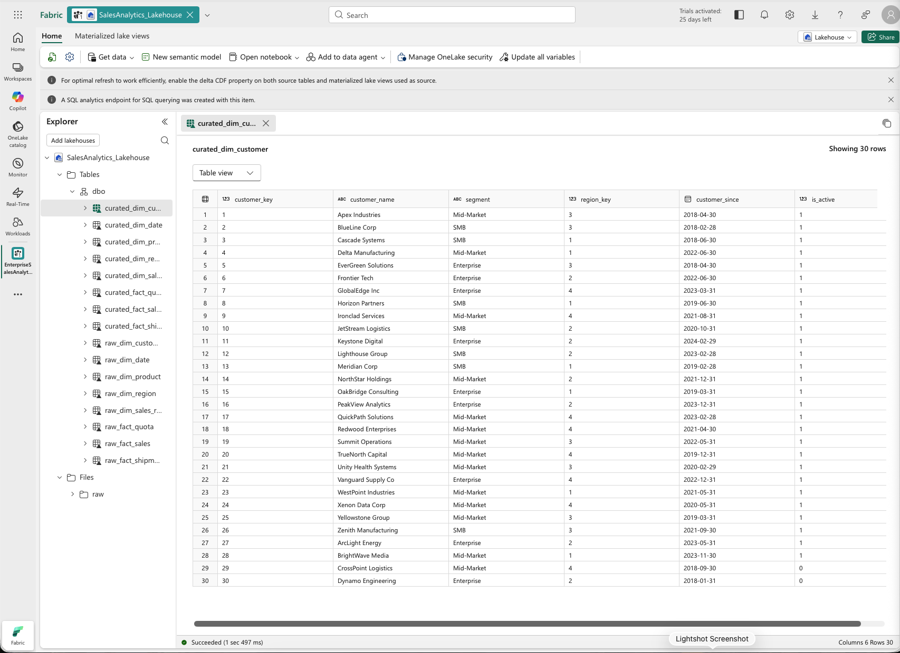

<div align="center">

<picture>
  <source media="(prefers-color-scheme: dark)" srcset="assets/nh-logo-dark.svg" width="80">
  <source media="(prefers-color-scheme: light)" srcset="assets/nh-logo-light.svg" width="80">
  
</picture>

# Revenue Data Product

**Governed, finance-grade revenue dataset on the Databricks Lakehouse with a published data contract and blocking DQ gates**

[](DATA_CONTRACT.md)
[](#architecture)
[](LICENSE)


</div>

---

### What This Does

Productizes the realized-revenue view of sales so Finance and Analytics consume one contracted source instead of reconciling divergent filters across dashboards. Business rules live in the data layer. Data quality signals live on the runs table. Consumers stay thin and governed.

The pipeline: Azure SQL star schema is ingested via JDBC into Databricks. A PySpark transformation applies the Completed-only realized-revenue rule, joins conformed dimensions, and writes a partitioned Delta table at `revenue.silver.fact_sales_completed`. A published data contract defines ownership, SLA, grain, semantics, and exclusion policy. A blocking DQ task enforces null, grain, status, and freshness gates plus source-to-curated reconciliation. Every run logs one row to `revenue.ops.fact_sales_completed_runs` with SLA status, drift, and failure detail. Power BI consumes the silver table and reads the runs table for a health tile.

---

### Architecture



The silver job reads Azure SQL via JDBC, applies the Completed-only business rule, joins conformed dimensions, and writes a partitioned Delta table. The DQ task runs reconciliation and null/grain/SLA checks, then logs one row per run to the `fact_sales_completed_runs` operations table, which is where dataset-level SLA status lives. Bronze is out of scope for v1 to keep the contract surface narrow; a gold aggregate layer is a future iteration.

---

### Platform Walkthrough

The same flow, shown across the platforms it actually runs on.

**1. Source relational schema.** Azure SQL (`EnterpriseSalesAnalytics`) holds the conformed star schema — `dim_customer`, `dim_date`, `dim_product`, `dim_region`, `dim_sales_rep`, and the `fact_sales` / `fact_quota` / `fact_shipments` transaction tables. This is the system of record; no business rules are applied here.



**2. Databricks JDBC ingestion and transformation.** Databricks reads the source over JDBC into Spark DataFrames, applies the Completed-only realized-revenue rule, and joins conformed dimensions before writing Delta. Credentials resolve from Unity Catalog secret scopes, never from notebook code.



**3. Curated lakehouse output.** The curated dimension and fact tables land in the lakehouse as the governed contract surface. Power BI and operational reporting read from here — not from raw ingestion — so downstream consumers stay stable as source systems evolve.



---

### Design Principles

1. The data carries its own health signals. Consumers do not need to check external dashboards to know if the data is trustworthy.
2. Business logic lives at the data layer, not in reports. Reports stay thin, governed, and consistent.
3. The data product has an owner, an SLA, a consumer list, and a published contract. Anything less is a script.
4. SLA is a dataset-level property, not a row-level attribute. Run outcomes live in a separate ops table, never on the transaction fact.
5. Breaking changes require consumer notification, not just a commit.

---

### Operational Visibility

Dataset-level health lives in `revenue.ops.fact_sales_completed_runs`:

| Column | Purpose |
|---|---|
|  | Unique identifier for the pipeline run |
|  | UTC timestamp of the run |
|  | Curated row count produced by the run |
|  | Source Completed row count at run time |
|  | Absolute drift between source and curated |
|  | Freshness lag at run time |
|  |  /  /  |
|  | Overall DQ outcome |
|  | Populated when `checks_passed = false` |

This is the audit trail and the source of the health tile a Power BI semantic model reads.

---

### Blocking DQ Gates

Every run of the DQ task enforces these checks. Any failure fails the job and blocks downstream consumption.

| Gate | Check | Severity |
|---|---|---|
|  | `row_count > 0` on the curated table |  |
|  | Zero nulls in `transaction_id`, `transaction_date`, `customer_key`, `product_key`, `net_revenue`, `order_status` |  |
|  | Zero rows where `order_status != 'Completed'` |  |
|  | `transaction_id` unique across the table |  |
|  | `max(transaction_date) >= current_date - 2` |  |
|  | Row count drift vs Azure SQL source ≤ 1% |  |

Referential integrity is enforced at build time via inner joins on `dim_customer`, `dim_product`, and `dim_date`.

---

### SLA Status Logic

| Freshness Lag | Status |
|---|---|
| ≤ 12 hours |  |
| 12 to 48 hours |  |
| > 48 hours |  |

`RED` blocks the run. `AMBER` passes with a warning logged to the runs table.

---

### Repo Layout

```
.
├── notebooks/
│   ├── silver/
│   │   └── fact_sales_completed.py          # JDBC extract + Completed-only transform + Delta write
│   └── dq/
│       └── run_checks_task.py               # Final workflow task wrapping run_checks()
├── sql/
│   └── ddl/
│       ├── fact_sales_completed.sql         # Silver Delta DDL + ZORDER
│       └── fact_sales_completed_runs.sql    # Ops runs table DDL
├── dq/
│   └── checks.py                            # Blocking DQ + reconciliation + run logging
├── docs/
│   ├── architecture.mmd                     # Mermaid source
│   └── architecture.png                     # Rendered diagram
├── assets/
│   ├── nh-logo-dark.svg
│   └── nh-logo-light.svg
├── DATA_CONTRACT.md                         # Ownership, SLA, schema, exclusions
├── CHANGELOG.md                             # Versioned changes
├── LICENSE                                  # MIT
└── README.md
```

---

### Running

The Databricks Workflow has two tasks:

1. `notebooks/silver/fact_sales_completed.py`: extract, transform, write silver
2. `notebooks/dq/run_checks_task.py`: blocking DQ gates and run log

Both tasks read secrets from the `kv-revenue` scope. Before the first run, apply both DDLs:

```sql
-- Silver table
sql/ddl/fact_sales_completed.sql

-- Ops runs table
sql/ddl/fact_sales_completed_runs.sql
```

The DQ task wraps `dq.checks.run_checks(spark, jdbc_url, jdbc_props)` so source-to-curated reconciliation runs against the same source system the silver task reads from. One row is appended to `revenue.ops.fact_sales_completed_runs` on every execution, pass or fail.

---

### Tech Stack

| Component | Technology |
|---|---|
|  | Azure SQL Database |
|  | JDBC (MSSQL driver) |
|  | Databricks (PySpark, Unity Catalog, Delta Lake) |
|  | Databricks Workflows |
|  | Assertion-based checks run as final job task |
|  | `revenue.ops.fact_sales_completed_runs` Delta table |
|  | Power BI semantic model |
|  | Published data contract + Unity Catalog lineage |

---

### Ownership

Data Product Owner: Nicholas Hidalgo. See [`DATA_CONTRACT.md`](DATA_CONTRACT.md) for SLA, schema, semantics, and exclusion policy. See [`CHANGELOG.md`](CHANGELOG.md) for versioned changes.

---

<div align="center">

[](https://linkedin.com/in/nicholashidalgo)&nbsp;
[](https://nicholashidalgo.com)&nbsp;
[](mailto:analytics@nicholashidalgo.com)

</div>
